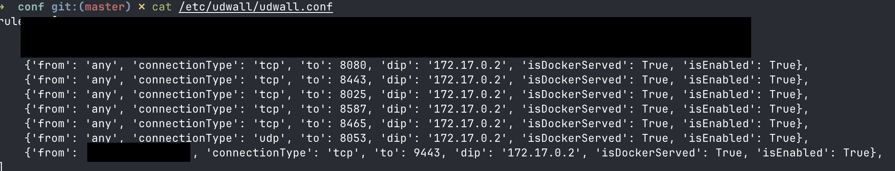

# Burp Collaborator Server docker container with LetsEncrypt certificate

This repository includes a set of scripts to install a Burp Collaborator Server in a docker environment, using a LetsEncrypt wildcard certificate.
The objective is to simplify as much as possible the process of setting up and maintaining the server.

## Requirements
* A custom domain where you can control `glue` records and primary nameservers
* Internet accessible server like a VPS
* bash
* docker
* bc command
* openssl command
* Burp Suite Professional jar file

## Setup your domain
Delegate a domain or subdomain to your soon-to-be burp collaborator server IP address.

If your collaborator domain is `burp.example`, you need to make `glue` records pointing to the public IP of the server, e.g. `1.2.3.4`.  

In your domain registrar, find where to manage `glue` records for your domain. 

Create one for `ns1.burp.example` and `ns2.burp.example`:

  

  

<br>
Make sure to make your `glue` records the primary nameservers for the domain:  


After waiting an hour or more, below is an example of using https://dnschecker.org/#NS/burp.example to check if records have propogated. 

In some cases, not all DNS servers will propogate the records until burp is up and running. Once you start seeing a couple green checkmarks, it should be OK to proceed.

  

Check https://portswigger.net/burp/documentation/collaborator/deploying#dns-configuration for further info.


## Setup the environment 
1) Clone or download the repository to the server, to a directory of your choice.
2) Put the Burp Suite JAR file in `./burp/pkg/burp.jar` (make sure the name is exactly `burp.jar`, and it is the actual file **not a link**)

3) Run `init.sh` with your burp domain and server public IP address as arguments:
```bash
./init.sh burp.example 1.2.3.4
```

This will start the environment for the subdomain `burp.example`, creating a wildcard certificate as `*.burp.example`.

I'm using an ugly hack on the certbot-dns-cloudflare plugin from certbot, where it just runs a local dnsmasq with the required records, and makes
all of this automagically happen.

If everything is OK, burp will start with the following message:

> Burp is now running with the letsencrypt certificate for domain *.burp.example

You can check by running `docker ps`, and going to burp, and pointing the collaborator configuration to your new server. 
Keep it mind that this configuration configures the *polling server on port 9443*.

The `init.sh` script will be renamed and disabled, so no accidents may happen.

## Certificate renewal

* There's a renewal script in `./certbot/certificaterenewal.sh`. When run, it renews the certificate if it expires in 30 days or less;
* Optionally, edit the RENEWDAYS variable if you wish to. By default it will renew the certificate every 60 days. *If you want to force the renewal to check if everything is working, just set it to 89 days, and run it manually. Remember to set it back to 60 afterwards.*;
* Set your crontab to run this script once a day.

## Updating Burp Suite

* Download it and make sure you put it in ```./burp/pkg/burp.jar```
* Restart the container with ```docker restart burp```

## Hardening with UFW
Both UFW and Docker modify the same [iptables](https://en.wikipedia.org/wiki/Iptables "iptables") configurations. Whatever rules you have set, running a docker container completely ignores them and allows traffic, regardless of whether you explicitly block access.

In order to fix the issue and be able to use UFW properly with docker, we can use `udwall`: 
https://github.com/HexmosTech/udwall

1) Set up your intended UFW rules. 

Make sure you add a rule to allow yourself to SSH into your server, so you don't get locked out.
```bash
sudo ufw allow ssh
```

2) The below assumes you're using the default ports from this repo's config. These ports should be allowed from all IPs, as this is how you use Collaborator to test for out-of-band interactions from your target.
- Note each rule has to be on its own line in order for `udwall` to detect them properly, such as below:
```bash
sudo ufw allow 8080/tcp
sudo ufw allow 8443/tcp
sudo ufw allow 8025/tcp
sudo ufw allow 8587/tcp
sudo ufw allow 8465/tcp
sudo ufw allow 8053/udp
```

You should restrict access to tcp 9443 or 9090 from specific IP addresses. This will prevent unauthorized users from abusing your collaborator server. 
- Replace `x.x.x.x` with your desired IP address
```bash
sudo ufw allow from x.x.x.x proto tcp to any port 9443

# Optional - if using HTTP to poll
sudo ufw allow from x.x.x.x proto tcp to any port 9090
```

3) Create the `udwall` config based on your existing UFW rules:
```bash
sudo udwall --create
```

The udwall config will be generated to `/etc/udwall/udwall.conf` 

4) Run the below command to grab the burp container's IP. 
- In my example, it is `172.17.0.2`
```bash
sudo udwall --dip
```

5) Edit the `udwall` config. Make sure the ports that are for the burp container have the following: `'dip': 'container_ip_here'` and  `'isDockerServed': True'`

The syntax for the config file is available on the `udwall` github.


6) Finally, apply and enable the `udwall` config. This will back up your current state, remove undefined rules, and apply the new ones based on the configuration file.
- Backups are stored in `$HOME/.udwall/backups`.
```bash
sudo udwall --apply
sudo udwall --enable
```

If all is well and good, https://burp.example should be reachable via your browser, and https://burp.example:9443 should be pollable by your Burp.