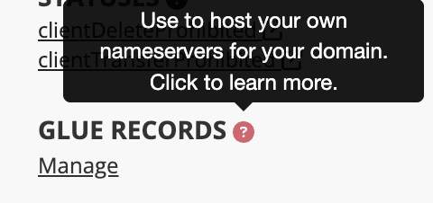
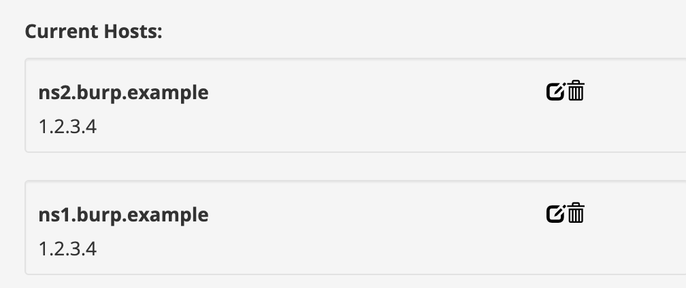
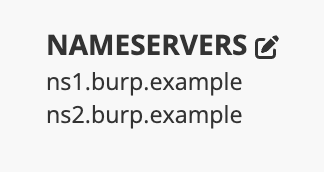
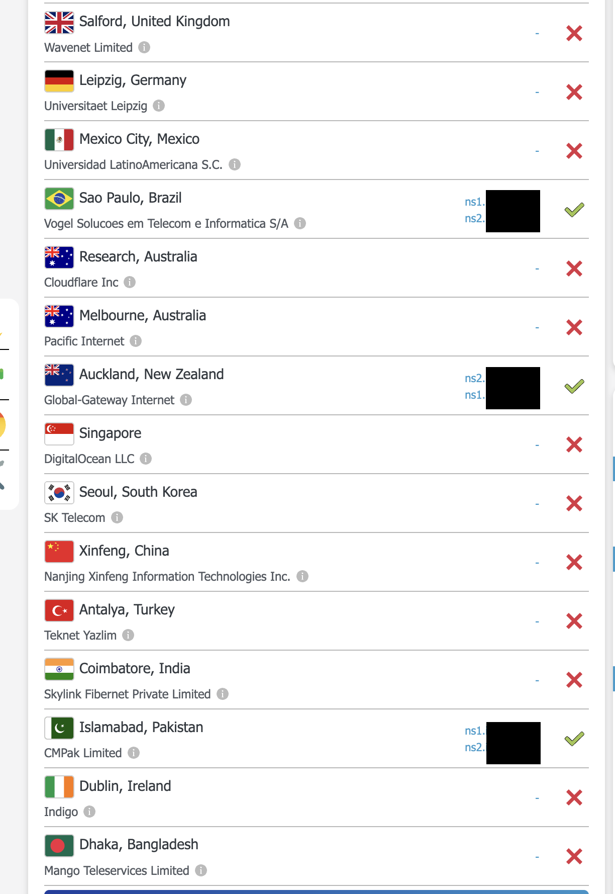

# Burp Collaborator Server docker container with LetsEncrypt certificate

This repository includes a set of scripts to install a Burp Collaborator Server in a docker environment, using a LetsEncrypt wildcard certificate.
The objective is to simplify as much as possible the process of setting up and maintaining the server.

## Requirements
* A custom domain where you can control `glue` records and primary nameservers
* Internet accessible server like a VPS
* bash
* docker
* bc command
* openssl command
* Burp Suite Professional jar file

## Setup your domain
Delegate a domain or subdomain to your soon-to-be burp collaborator server IP address.

If your collaborator domain is `burp.example`, you need to make `glue` records pointing to the public IP of the server, e.g. `1.2.3.4`.  

In your domain registrar, find where to manage `glue` records for your domain. 

Create one for `ns1.burp.example` and `ns2.burp.example`:



Then make sure to make your `glue` records the primary nameservers for the domain:


After waiting an hour or more, below is an example of using https://dnschecker.org/#NS/burp.example to check if records have propogated. 

In some cases, not all DNS servers will propogate the records until burp is up and running. Once you start seeing a couple green checkmarks, it should be OK to proceed.


Check https://portswigger.net/burp/documentation/collaborator/deploying#dns-configuration for further info.


## Setup the environment 
1) Clone or download the repository to the server, to a directory of your choice.
2) Put the Burp Suite JAR file in `./burp/pkg/burp.jar` (make sure the name is exactly `burp.jar`, and it is the actual file **not a link**)

3) Run `init.sh` with your burp domain and server public IP address as arguments:
```bash
./init.sh burp.example 1.2.3.4
```

This will start the environment for the subdomain `burp.example`, creating a wildcard certificate as `*.burp.example`.

I'm using an ugly hack on the certbot-dns-cloudflare plugin from certbot, where it just runs a local dnsmasq with the required records, and makes
all of this automagically happen.

If everything is OK, burp will start with the following message:

> Burp is now running with the letsencrypt certificate for domain *.burp.example

You can check by running `docker ps`, and going to burp, and pointing the collaborator configuration to your new server. 
Keep it mind that this configuration configures the *polling server on port 9443*.

The `init.sh` script will be renamed and disabled, so no accidents may happen.

## Certificate renewal

* There's a renewal script in `./certbot/certificaterenewal.sh`. When run, it renews the certificate if it expires in 30 days or less;
* Optionally, edit the RENEWDAYS variable if you wish to. By default it will renew the certificate every 60 days. *If you want to force the renewal to check if everything is working, just set it to 89 days, and run it manually. Remember to set it back to 60 afterwards.*;
* Set your crontab to run this script once a day.

## Updating Burp Suite

* Download it and make sure you put it in ```./burp/pkg/burp.jar```
* Restart the container with ```docker restart burp```

## Docker and UFW
If you use UFW/IPTables as your firewall on the host, both UFW and docker modify the same [iptables](https://en.wikipedia.org/wiki/Iptables "iptables") configurations. Whatever UFW rules you have set, running a docker container completely ignores them and allows traffic, regardless of whether you explicitly block access. In order to fix the issue and be able to use UFW properly with docker, read this: 

https://blog.jarrousse.org/2023/03/18/how-to-use-ufw-firewall-with-docker-containers/

These instructions assume you have the default docker set up and didn't try to fix the problem yourself yet.
**Download `ufw-docker` script**
```bash
sudo wget -O /usr/local/bin/ufw-docker https://github.com/chaifeng/ufw-docker/raw/master/ufw-docker
sudo chmod +x /usr/local/bin/ufw-docker
```

Then using the following command to modify the `after.rules` file of `ufw`
```bash
ufw-docker install
```

reboot the host and check if you can access the ports of your container.

Now allow the traffic to the ports on the containers
- Use the actual port thats open on the container, not the one its binded to on the host
- `burp` is the container name, so thats what we use with below command
```bash
docker ps -a
sudo ufw-docker allow burp 8443
```


I have provided the commands conventiently for you here:
```bash
sudo ufw-docker allow burp 8053
sudo ufw-docker allow burp 8053/udp
sudo ufw-docker allow burp 8080
sudo ufw-docker allow burp 8443
sudo ufw-docker allow burp 8465
sudo ufw-docker allow burp 8587
sudo ufw-docker allow burp 8080
```

I HIGHLY recommend restricting access to your polling port from an IP address or network. Don't allow the general internet to use your burp collab server for free!
- `your_whitelisted_ip` is your public IP to allow access from
- `your_containers_local_ip` is 172.x.x.x

```bash
ufw route allow proto tcp from your_whitelisted_ip to your_containers_local_ip port 9443
```

You should be good to go and have your UFW locked down!

---
**Author:** [Bruno Morisson](https://twitter.com/morisson)

Thanks to [Fábio Pires](https://twitter.com/fabiopirespt) (check his burp collaborator w/letsencrypt [tutorial](https://blog.fabiopires.pt/running-your-instance-of-burp-collaborator-server/)) and [Herman Duarte](https://twitter.com/hdontwit) (for betatesting and fixes)


